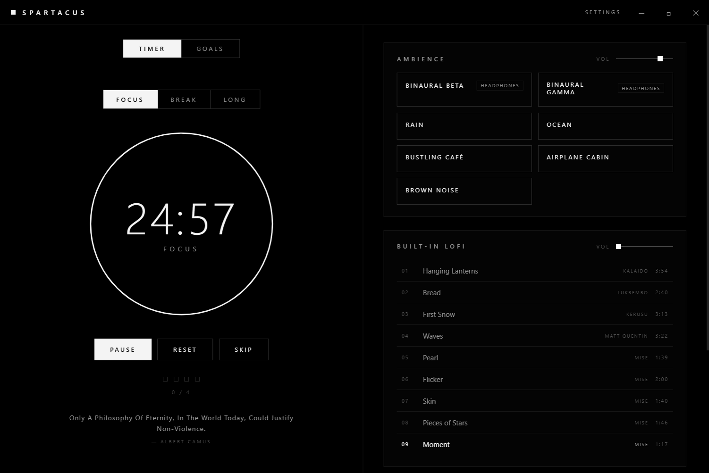
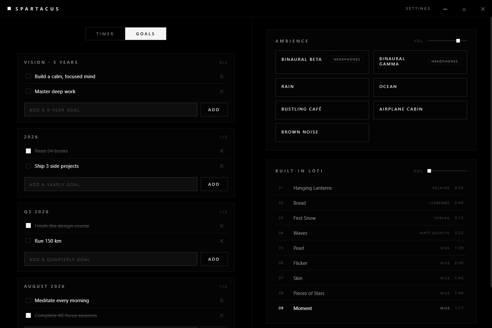
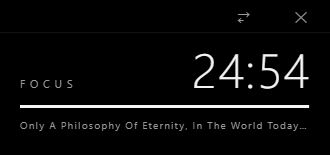
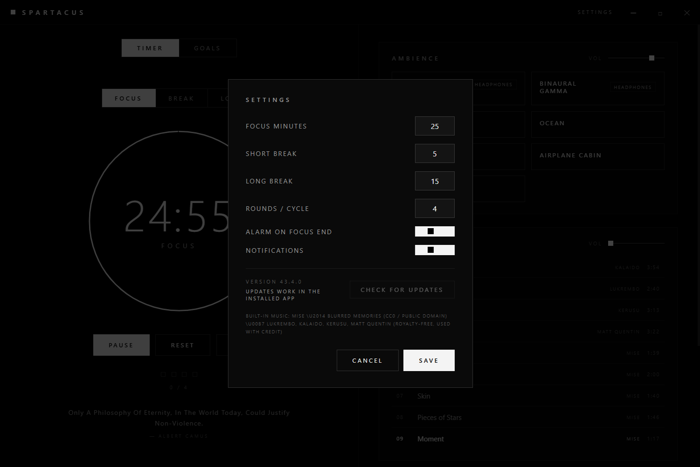

# SPARTACUS



Spartacus is a calm place to focus. Your timer, the right sounds, and your goals, all in one quiet window.

## Why

Most focus tools work against us. Timers are cluttered. Music apps are built to keep you browsing. Video sites sit one click away. And the goals that actually matter keep getting pushed aside by whatever feels urgent today.

Spartacus exists because staying focused should not be a fight. You get one place where your timer, your music, and your goals live together, with nothing else competing for your attention.

## How

Spartacus keeps the things that help you focus close, and the things that distract you far away.

- One calm window. The timer, your sounds, and your goals sit side by side. No feeds, no ads, no noise.
- Sounds that support you. Ambient soundscapes and lofi music play without video, ads, or endless browsing. Paste a YouTube link and only the audio comes in.
- Every session connects to something bigger. Your five year vision, this year's goals, this quarter, this month. All visible while you work.
- It gets out of your way. Shrink the app into a tiny widget that floats above your other windows and shows the time left, so your screen stays yours.

## What

### Focus timer with a gentle alarm

Work in 25 minute sessions with short breaks in between. The ring empties as time passes. When a session ends you get a soft bell melody, a notification, and the taskbar flashes. No harsh buzzer.

### Goals from five years down to this month

Keep your five year vision at the top, then break it down into yearly, quarterly, and monthly goals. Tick things off as you go. Past months are kept, so nothing you wrote gets lost.



### Ambient soundscapes

Rain, ocean, a bustling cafe, an airplane cabin, brown noise, and binaural beats. Every sound is generated live, works offline, and can be layered with others. Each one has its own volume.

### Built-in lofi with its own backdrop

Nine lofi tracks come with the app, no internet needed. Each track has its own background photo that fades in when the track starts playing.

### Your YouTube music, audio only

Paste any YouTube link. Spartacus extracts just the audio, keeps it on your computer, and plays it from a queue you control. No video, no comments, no autoplay.

### A tiny window that stays with you

Click the minimize button and Spartacus becomes a small widget floating above your windows, showing the time left in your session and a motivational quote.



### Daily motivation

A fresh quote appears in the app and in the mini window. It refreshes every 30 minutes, or click it to get a new one right away.

### Settings that stay out of your way

Adjust session lengths, alarm, notifications, and updates from one place.



## Install

1. Download the installer from the [latest release](https://github.com/msyafach/spartacus/releases/latest).
2. Open it and pick a folder. No admin rights needed.
3. Start Spartacus from your Start Menu or desktop.

Installing over an older version works fine. Your goals, queue, and settings are kept. Uninstalling keeps them too, in case you come back.

Updates arrive automatically. When a new version is ready you get a notification, and it installs when you restart. You can also check manually in Settings.

## Notes

- Your YouTube tracks are kept in a small cache folder, so replaying them is instant. It is capped at about 400 MB and old tracks are cleared automatically.
- Keyboard shortcuts: `Space` start or pause the timer, `R` reset, `S` skip, `Esc` leave mini mode.
- Built-in music: MISE (Blurred Memories, public domain), plus Lukrembo, Kalaido, Kerusu, and Matt Quentin (royalty free, credited here).
- Background photos from Unsplash (free license).

## Building from source

Requires Node.js 22 or newer.

```bash
npm install
npm start
```

To build an installer, run `npm run dist`. The workflow in `.github/workflows/release.yml` builds and publishes a release automatically whenever you push a version tag.
